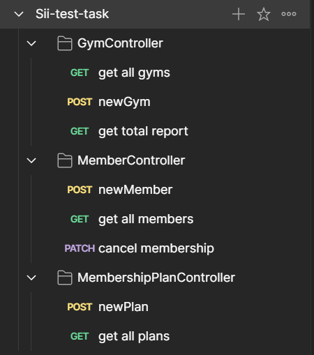
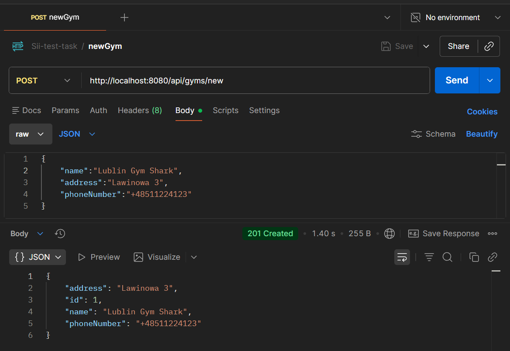
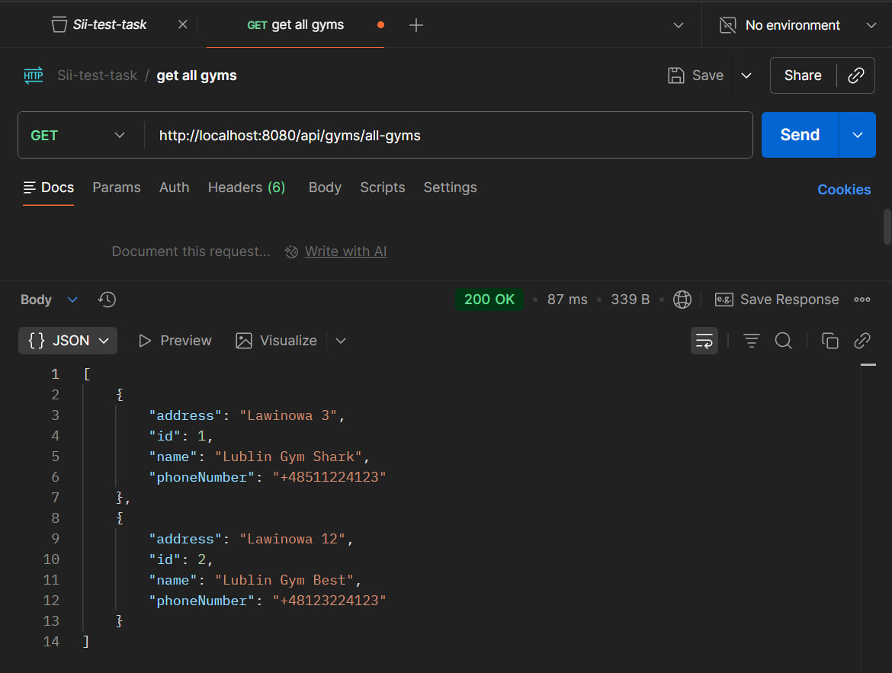
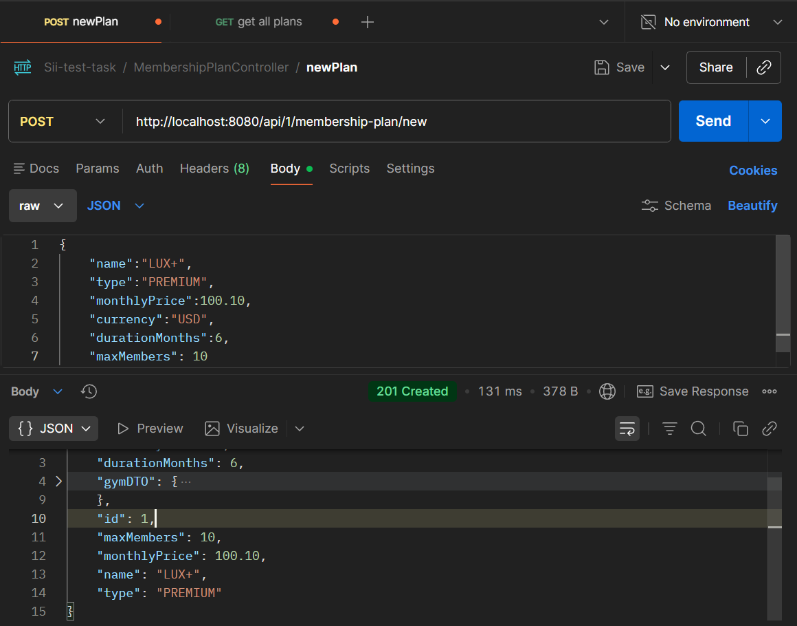
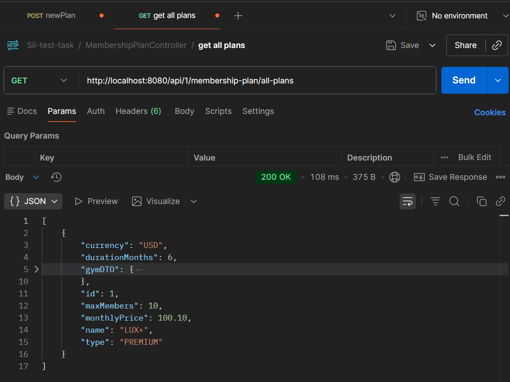
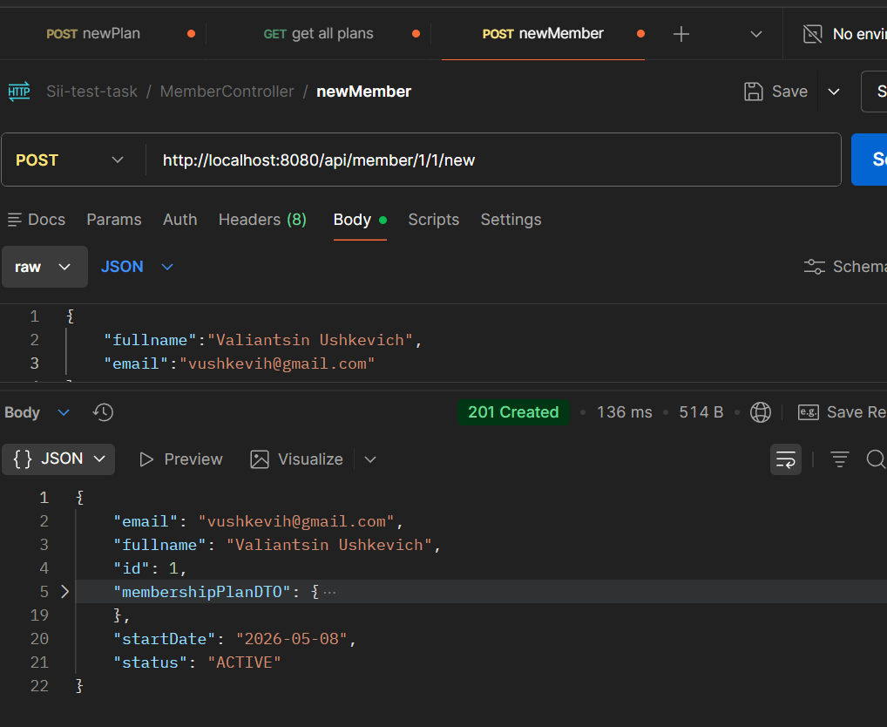
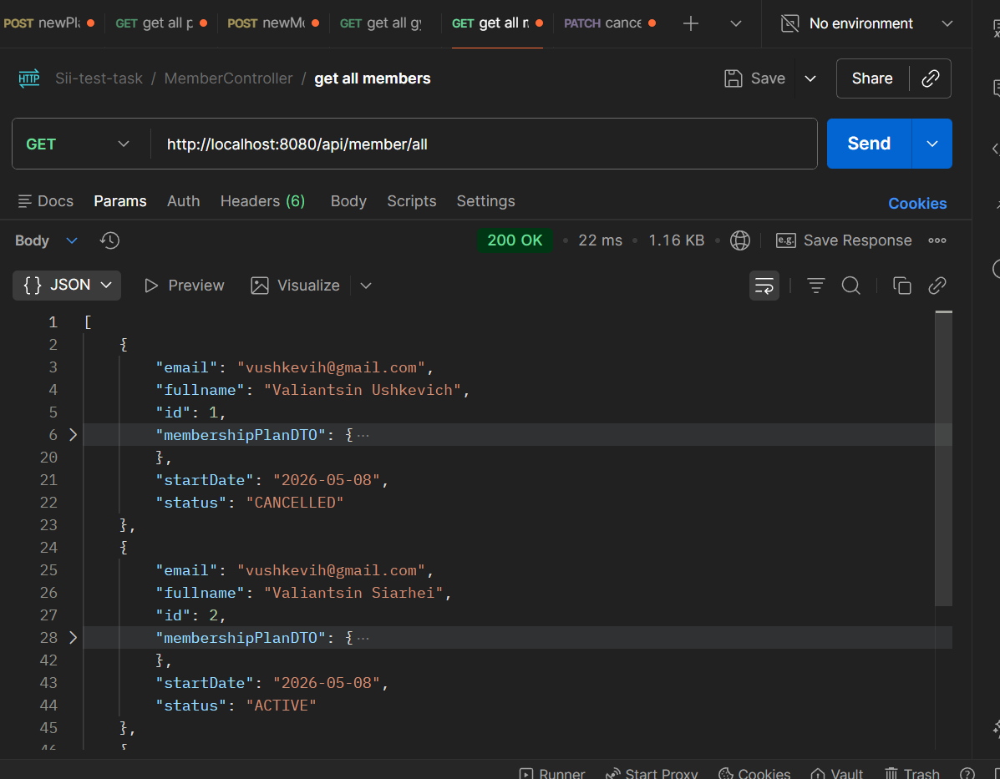
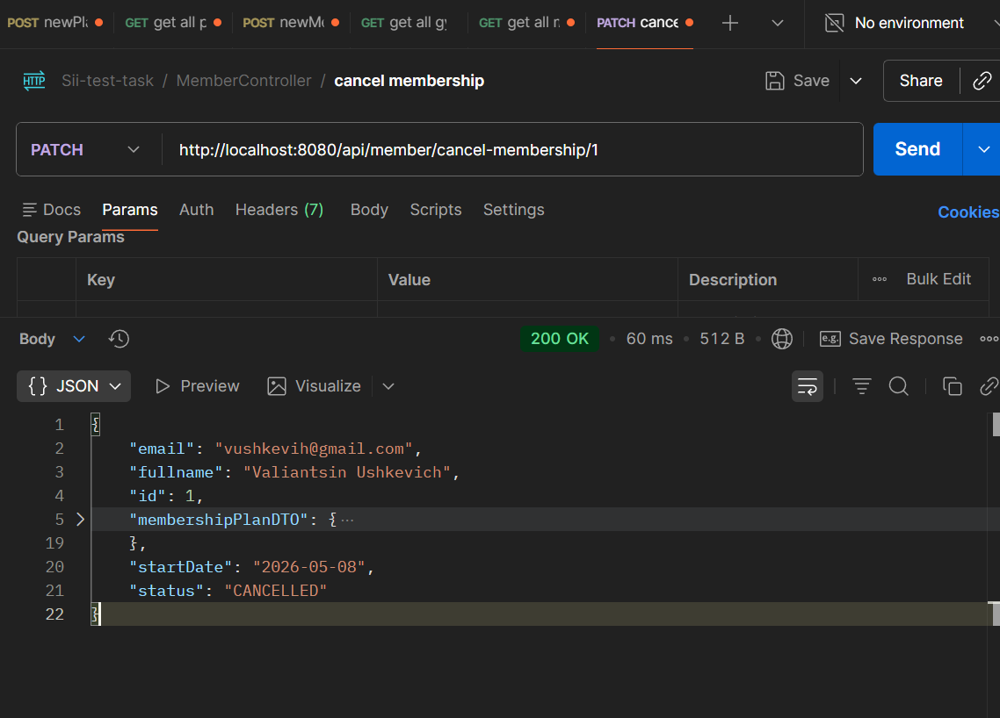
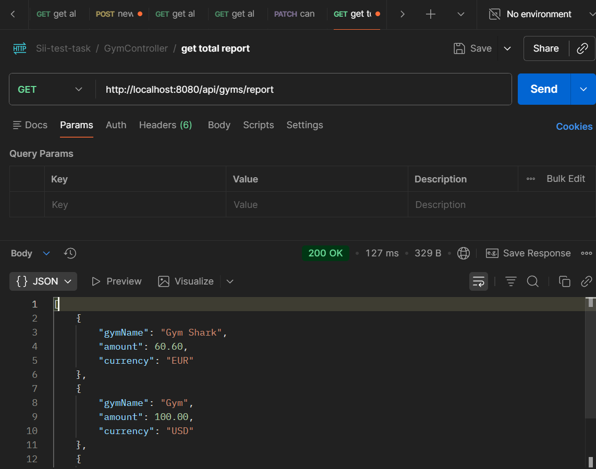

# Gym Membership Management System Technical Task

<p align="center">


</p>

**Gym Membership Management System Technical Task** – REST API for managing gym memberships, including gyms, membership plans and members.

---

## 📑 Table of Contents

* [Tech Stack](#-tech-stack)
* [How to Run the Project](#-how-to-run-the-project)
* [REST	API	endpoints](#-rest-api-endpoints)
* [Project Structure](#-project-structure)
* [Database Structure](#-database-structure)

---

## 🏗 Tech Stack

* **Java:** 21
* **Spring Boot:** 4.0.6
* **Apache-Maven:** 4.0.0
* **Database:** H2

---

## 🚀 How to Run the Project

1.  **Clone the repository:**
    ```bash
    git clone https://github.com/rakets/Sii-test-task.git
    ```
2.  **Go to the project folder:**
    ```bash
    cd Sii-test-task
    ```
3.  **Build the project:**
    ```bash
    mvn clean install
    ```
6.  **Run the project:**
    ```bash
    mvn spring-boot:run
    ```
    Server will be available at `http://localhost:8080`.

---

## 🚀 REST	API	endpoints

Whole endpoints documentation for POSTMAN you can find in project folder -> **./docs/Sii-test-task.postman_collection.json**

<p align="center">
    
</p>

1. **Create a new gym:**
    ```bash
    http://localhost:8080/api/gyms/new
    ```

    <p align="center">
        
    </p>

2. **List all gyms:**
    ```bash
    http://localhost:8080/api/gyms/all-gyms
    ```

    <p align="center">
        
    </p>

3. **Create	a new membership plan for a given gym:**

    <p> for example, we try to create new plan for gym with ID = 1. </p>

    ```bash
    http://localhost:8080/api/1/membership-plan/new
    ```

    <p align="center">
        
    </p>

4. **List all membership plans for a given gym:**
    
    <p> for example, we try to get all plans for gym with ID = 1. </p>
    
    ```bash
    http://localhost:8080/api/1/membership-plan/all-plans
    ```

    <p align="center">
        
    </p>

5. **Register a new	member to a given membership plan (validate	capacity):**
    
    <p> for example, we try to register new member for gym with ID = 1 and plan with ID = 1. </p>

    ```bash
    http://localhost:8080/api/member/1/1/new
    ```

    <p align="center">
        
    </p>

6. **List all members - include the	plan name, gym name and status:**
    ```bash
    http://localhost:8080/api/member/all
    ```

    <p align="center">
        
    </p>

7. **Cancel a membership:**

    <p>for example, we cancel membership plan for member with ID = 1</p>

    ```bash
    http://localhost:8080/api/member/cancel-membership/1
    ```

    <p align="center">
        
    </p>

8. **Return the	revenue	report:**
    ```bash
    http://localhost:8080/api/gyms/report
    ```

    <p align="center">
        
    </p>

---

## 📂 Project Structure

```
Sii-test-task/
│
├── src/
│   ├── main/
│   │   ├── java/com/test_task.sii/
│   │   │   │
│   │   │   ├── controller/
│   │   │   │   ├── GymController.java
│   │   │   │   ├── MemberController.java
│   │   │   │   └── MembershipPlanController.java
│   │   │   │
│   │   │   ├── dto/
│   │   │   │   ├── GymDTO.java
│   │   │   │   ├── MemberDTO.java
│   │   │   │   ├── MembershipPlanDTO.java
│   │   │   │   └── ReportDTO.java
│   │   │   │
│   │   │   ├── entity/
│   │   │   │   ├── Gym.java
│   │   │   │   ├── Member.java
│   │   │   │   ├── MembershipPlan.java
│   │   │   │   ├── MemberStatus.java
│   │   │   │   └── PlanType.java
│   │   │   │
│   │   │   ├── repository/
│   │   │   │   ├── GymRepository.java
│   │   │   │   ├── MemberRepository.java
│   │   │   │   └── MembershipPlanRepository.java
│   │   │   │
│   │   │   ├── service/
│   │   │   │   ├── GymService.java
│   │   │   │   ├── MemberService.java
│   │   │   │   └── MembershipPlanService.java
│   │   │   │
│   │   │   └── SiiApplication.java
│   │   │
│   │   └──  resources/
│   │        └── application.properties
│   │
│   └── test/
│       └── java/com/test_task.sii/
│           └── SiiApplicationTests.java
│
├── pom.xml
├── README.md
└── .gitignore
```

---

## 📂 Database Structure

<p align="center">
    
</p>


